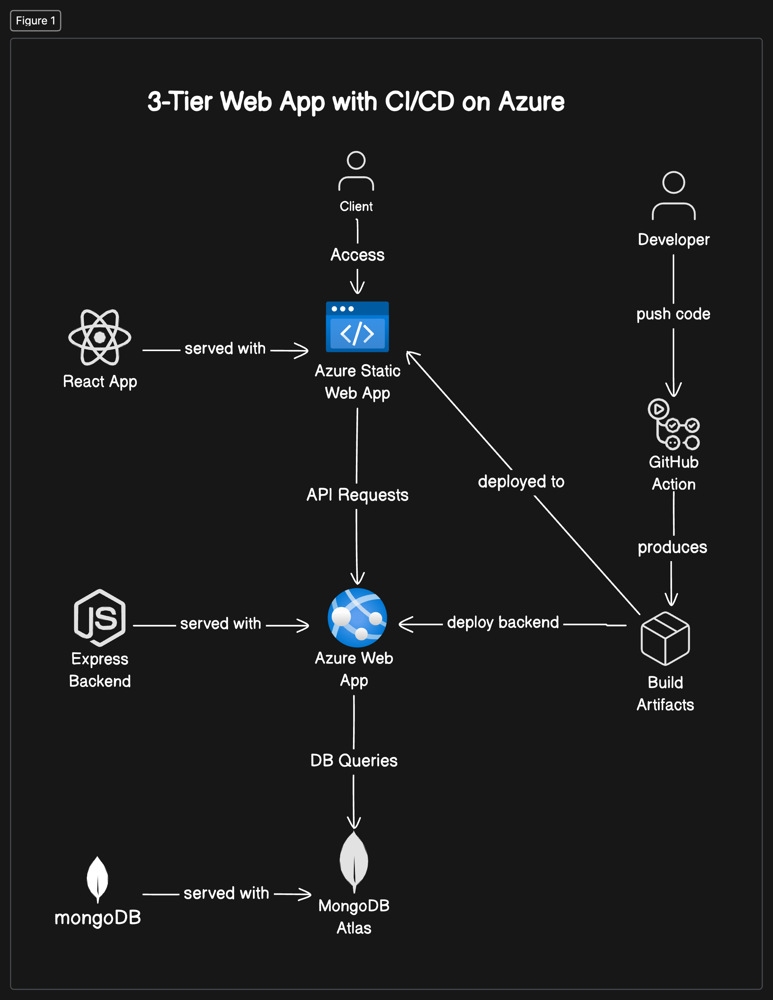

# MEAN Stack Sample App - Deploy to Azure with CI/CD built-in

This project is a MERN (MongoDB, Express.js, React, and Node.js) Application. It's a simple employee management app that let's you add and edit records of your employee. 

The main purpose of this repo is to serve as an example of how one can deploy a modern web application using Azure Cloud Services.


## Overview Architecture



## Technology Stack 

- **MongoDB**: A NoSQL database for storing application data.
- **Express.js**: A web application framework for Node.js.
- **React**: A JavaScript library for building user interfaces.
- **Node.js**: A JavaScript runtime for server-side programming.
- **Azure Web App**: PaaS by Azure to deploy Express Application
- **Azure Static App**: PaaS by Azure to deploy Static Assets (React App)
- **MongoDB**: NoSQL Database deployed on MongoDB Atlas


## Prerequisites for Local Deployment

Before you begin, ensure you have met the following requirements:

- **Node.js**: Install Node.js from [nodejs.org](https://nodejs.org/).
- **MongoDB**: Create MongoDB Atlas Database from [mongodb.com](https://www.mongodb.com/products/platform/atlas-database).
- **Docker** (optional): Install Docker from [docker.com](https://www.docker.com/).

## Installation


1. **Clone the repository**:
    ```sh
    git clone https://github.com/sagar-uprety/MERN-App-Deployment-Automation.git

    cd mern-stack-example
    ```

2. Install server dependencies:
    ```sh
    cd app/server
    npm install
    ```

3. Setup config.env in app/server direcotry
   ``` 
    ATLAS_URI=<your-mongodb-ATLAS-connection-string>
    PORT=5050
    ```

4. Install client dependencies:
    ```sh
    cd app/client
    npm install
    ```
5. Setup .env file in app/client directory
    ```
    VITE_API_URL=http://localhost:5050
    ```


## Running the Application


1. Run the server (from app/server):
    ```sh
    npm run dev

    # or (Nodemon required)
    nodemon server.js

    # or
    npm start

    # Your backend should be running at localhost:5050
    ```

2. Run the client (from app/client):
    ```sh
    # Vite is used during development environment
    npm run dev 
    ```

3. Access the client application: Open your browser and navigate to http://localhost:5173.

## Project Structure

The project structure is as follows:

```
mern-stack-example/
├── .github/workflows (GitHub Actions Workflow File for CI/CD)
├── app/
│   ├── server/ # Backend (Node.js + Express)
│   └── client/ # Frontend (React.js)
├── package.json # Client dependencies
├── .gitignore # Files to be ignored by Git
└── README.md # Project documentation
```

- `server`: Contains the server-side code.
- `client`: Contains the client-side code.


## Environment Variables

Create a `.env` file in both the `server` and `client` directories to configure environment variables.

Server `.env`:
```
PORT=5000
MONGO_URI=mongodb://localhost:27017/myapp
JWT_SECRET=mysecretkey
```

Client `.env`:
```
REACT_APP_API_URL=http://localhost:5000/api
```

## Docker Support

### Building and Running with Docker Compose 

1. Build the Docker images:
    ```sh
    docker-compose build
    ```

2. Run the Docker containers:
    ```sh
    docker-compose up
    ```

3. Access the application: Open your browser and navigate to http://localhost:80 or http://localhost.

## Contributing

Contributions are always welcome! Please follow these steps:

1. Fork the repository.
2. Create a new branch (`git checkout -b feature-branch`).
3. Make your changes.
4. Commit your changes (`git commit -m 'Add some feature'`).
5. Push to the branch (`git push origin feature-branch`).
6. Open a pull request.

## License

This project is licensed under the MIT License. See the LICENSE file for details.
